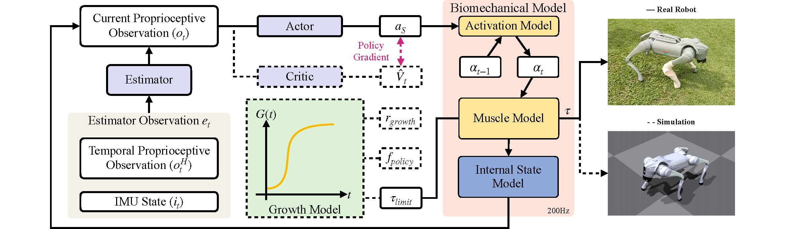

# SATA

Official Implementation for **[SATA: Safe and Adaptive Torque-Based Locomotion Policies Inspired by Animal Learning](https://arxiv.org/abs/2502.12674)**

Accepted at **Robotics: Science and Systems (RSS) 2025**

LI Peizhuo*. LI Hongyi*, Ge SUN, Jin CHENG, Xinrong YANG, Guillaume Bellegarda, Milad Shafiee, [Yuhong CAO](https://www.yuhongcao.online), Auke Ijspeert, [Guillaume SARTORETTI](https://cde.nus.edu.sg/me/staff/sartoretti-guillaume-a/)

<p align="center">
  
</p>

---

## 🧭 Overview

**SATA** is a torque-based reinforcement learning framework inspired by how animals progressively acquire locomotion capabilities.  
It introduces a biologically motivated **growth curriculum** that schedules torque limits and control frequency to evolve safely during training.

---

## Training in Simulation

### Pipeline to Install and Train ABS

**Note**: Before running our code, it's highly recommended to first play with [RSL's Legged Gym version](https://github.com/leggedrobotics/legged_gym) to get a basic understanding of the Isaac-LeggedGym-RslRL framework.
   <!-- <br/><br/> -->

1. Create environment and install torch

   ```text
   conda create -n xxx python=3.8  # or use virtual environment/docker
   
   pip3 install torch torchvision torchaudio --extra-index-url https://download.pytorch.org/whl/cu116  
   # used version during this work: torch==2.0.1 torchvision==0.15.2 torchaudio==2.0.2
   # for older cuda ver:
   pip3 install torch==1.10.0+cu113 torchvision==0.11.1+cu113 torchaudio==0.10.0+cu113 -f https://download.pytorch.org/whl/cu113/torch_stable.html
   ```

   

2. Install Isaac Gym preview 4 release https://developer.nvidia.com/isaac-gym

   unzip files to a folder, then install with pip:

   `cd isaacgym/python && pip install -e .`

   check it is correctly installed by playing: 

   ```cmd
   cd examples && python 1080_balls_of_solitude.py
   ```

   

3. Clone this codebase and install our `rsl_rl`

   ```cmd
   pip install -e rsl_rl
   ```


4. Install our `legged_gym`

   ```cmd
   pip install -e legged_gym
   ```

   Ensure you have installed the following packages:
    + pip install numpy==1.21 (must < 1.24, >1.20)
    + pip install tensorboard
    + pip install setuptools==59.5.0
    + pip install wandb
    
5. Try training.

   can use "--headless" to disable gui, press "v" to pause/resume gui play.

   for go2, in `SATA/legged_gym/legged_gym/envs/go2/go2_torque`,
    ```text
   python scripts/train.py --task=go2_torque
   ```
6. Play the trained policy

   ```cmd
   python scripts/play.py --task=go2_torque
   ```
## Troubleshooting:
### Contact
+ Corresponding author CAO Yuhong: caoyuhong@nus.edu.sg
+ Deployment: LI Peizhuo: lipeizhuo@u.nus.edu 
+ Policy Learning in Sim: LI Hongyi: hongyi.li@u.nus.edu


### Issues
You can create an issue if you meet any bugs, except:
+ If you cannot run the [vanilla RSL's Legged Gym](https://github.com/leggedrobotics/legged_gym), it is expected that you first go to the vanilla Legged Gym repo for help.
+ There can be CUDA-related errors when there are too many parallel environments on certain PC+GPU+driver combination: we cannot solve thiss, you can try to reduce num_envs.
+ Our codebase is only for our hardware system showcased above. We are happy to make it serve as a reference for the community, but we won't tune it for your own robots.

## Credit
If our work does help you, please consider citing us and the following works:
```bibtex
@article{li2025sata,
  title={SATA: Safe and Adaptive Torque-Based Locomotion Policies Inspired by Animal Learning},
  author={Li, Peizhuo and Li, Hongyi and Sun, Ge and Cheng, Jin and Yang, Xinrong and Bellegarda, Guillaume and Shafiee, Milad and Cao, Yuhong and Ijspeert, Auke and Sartoretti, Guillaume},
  journal={arXiv preprint arXiv:2502.12674},
  year={2025}
}
```

